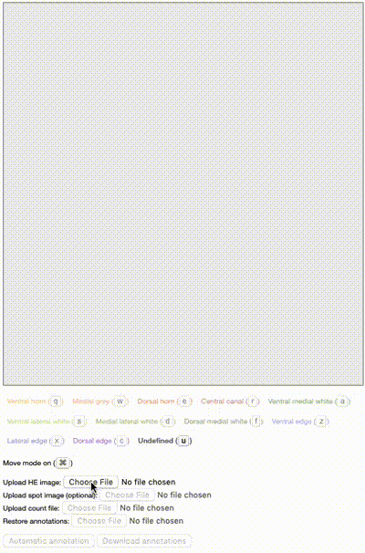

Span
===================

A simple js tool to annotate Spatial Transcriptomics (ST) [1] data.

Requirements 
-------------
Tested on macOS Mojave (10.14.6) and Chrome 75.

Panning and zooming are more fun when using a multi-touch trackpad.

Configuration 
-------------
Please see ``configuration.js``.

In most cases, you want to specify your own set of anatomical annotation regions (AARs) (``AAR_CATEGORIES``) and change the size of the canvas (``WIDTH``).

Usage
-------------
1. Specify the AARs in ``configuration.js``
2. Open ``span.html`` in a modern web browser
3. Upload the bright-field image of the ST array (e.g. hematoxylin and eosin (HE) stain)
4. Upload the cDNA footprint image of the ST array (*optional*)
5. Upload the count file
	- Check that the spots align with the cDNA footprint image
6. Upload previously added annotations (*optional*)
	- For curating the annotations or continuing the annotation task
7. Annotate the ST spots using the specified AARs
	- Canvas supports panning and zooming
	- Change the current AAR selection using mouse or keyboard shortcuts 
8. Download the annotations

The following animation demonstrates the aforementioned steps.

The directory ``examples`` contains some example data.

Experimental
-------------
**This feature is experimental and it only works on mouse lumbar spinal cord data.**

Tensorflow-based semi-automatic annotation of the spots can be enabled via ``TENSORFLOW_ANNOTATION`` in ``configuration.js``.

The multimodal classifier was trained on manually annotated mouse lumbar spinal cord data [2]. That is, the classifier predicts the AAR category of a ST spot based on its common coordinate and local histology image.

1. Upload the bright-field image, cDNA footprint image, and the count file 
2. Add a mouse lumbar spinal cord template by a double click
3. Move and rotate the template so that the reticle is centered on the central canal and the arrow aligns with the ventral-dorsal axis 
4. Press the "Automatic annotation" button
5. Curate manually the predictions

The following animation demonstrates the aforementioned steps.

### References
[1] Ståhl, Patrik L., et al. "Visualization and analysis of gene expression in tissue sections by spatial transcriptomics." *Science* 353.6294 (2016): 78-82.

[2] Maniatis, Silas, et al. "Spatiotemporal dynamics of molecular pathology in amyotrophic lateral sclerosis." *Science* 364.6435 (2019): 89-93.
